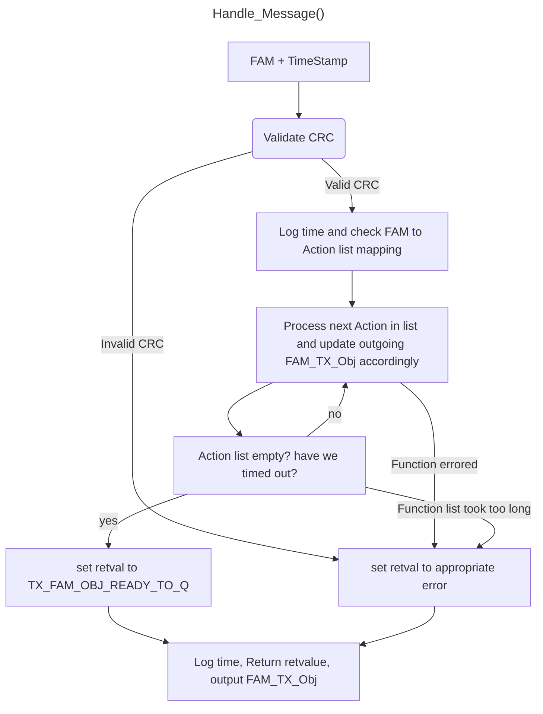
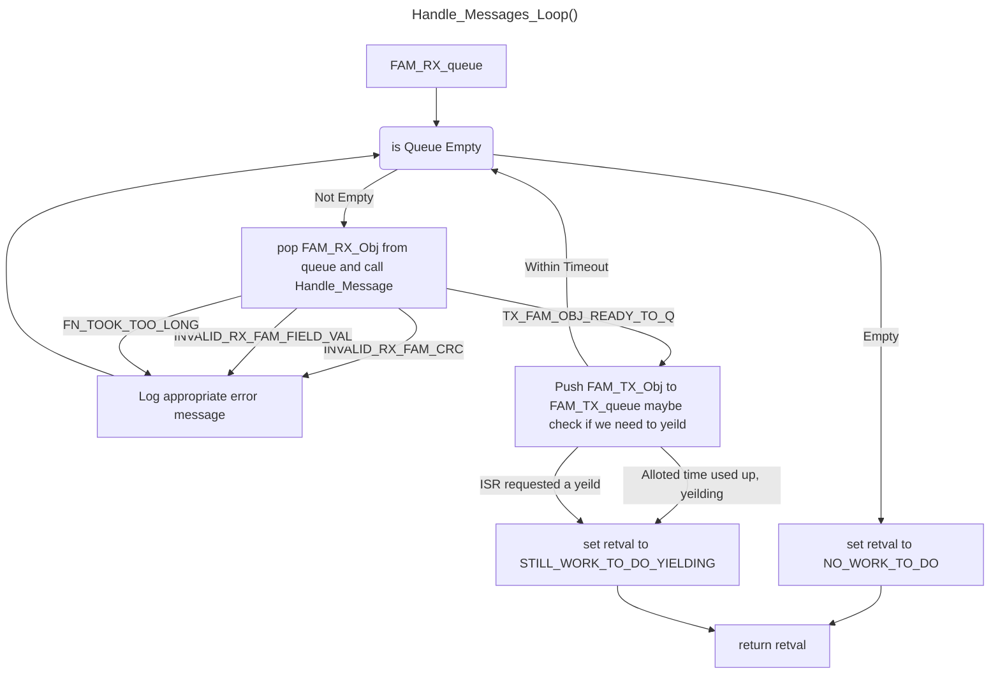

# Fontus Acoustic Message Handling 
## (FAM) Handling
### Overview:
`Handle_Message_Loop(RxFAMq, TxFAMq)` is a loop which consumes from a queue of received FAM messages bound to the PCM sample they arrived at, and pushes to a queue of FAM objects bound to their departure PCM count that they are to be sent

`Handle_Message()` **SHALL** be called in `Handle_Message_Loop()` to process the FAM received in to a FAM to transmit or an error to log.

For each FAM (fontus acoustic message) that qualifies as a request the Fontus modem **SHALL** be able to cary out a predefined list of `Action`s as defined by a table of FAM types to `Action` lists

Each `Action` **SHALL** be of the form: 
- take in a value from (RXFAM, Sensor, clock, getReleaseStatusfn)
- convert value from/to bitfield representation (could do no conversion if necessary)
- move value to (field in FAM_TX_Obj.bitfield, clock_updatefn, FAM_TX_Obj.TxTime, setGPIOvalue, do_releasefn)


#### i.e.
- get battery voltage, do conversion, `FAM_TX_Obj.bitfield.set("battery",newval,status)`
- get temperature, do conversion, `FAM_TX_Obj.bitfield.set("Temperature",newval,status)`
- get depth, do conversion, `FAM_TX_Obj.bitfield.set("Depth",newval,status)`
- generate CRC, (do conversion... is a one to one function), `FAM_TX_Obj.bitfield.set("Depth",newval,status)`

```C++
typedef struct PCM_count{
    uint64_t samples_of_audio,
}PCM_count;

typedef struct FAM_TxRx_Obj{
    uint64_t fontus_bitfield,
    PCM_count time_of_departure,
}FAM_TxRx_Obj;

typedef struct Action{
    //TODO: is a scratchpad needed for time conversions and clock updates? or other things? I don't think so
    /* uint8_t scratchpad[50] */ 
    uint64_t DataIn_Fn_Ptr(FAM_TxRx_Obj FAM_rx,/*,uint8_t scratchpad*/),
    uint64_t Conversion_Fn_Ptr(uint64_t/*,uint8_t scratchpad*/),
    uint64_t DataOut_Fn_Ptr(FAM_TxRx_Obj FAM_tx/*,uint8_t scratchpad*/),
}Action;

```

`Handle_Message()` **SHALL** get called in the `Handle_Messages_Loop()` to take a timestamped FAM element in and output a timestamped FAM element for transmission and or cause some other state change on the modem. 

The `Handle_message()` fn **SHALL** return one of these as a return value:
- `INVALID_RX_FAM_CRC`
- `INVALID_RX_FAM_FIELD_VAL`
- `TX_FAM_OBJ_READY_TO_Q`
- `FN_TOOK_TOO_LONG`

`Handle_Message()` **SHALL** access a table of FAMtypes to `Action` lists in order to execute requests from the incomming FAMs and to build up any response FAMs as needed.

> NOTE: Each `Action` list in the table **SHALL** return within N (micro/milliseconds) to ensure realtime operation.
As a development tool `Handle_Message()` **MAY** log the pcm sample count at the beginning of the function call and the end of the function call to catch any functions that take too long



